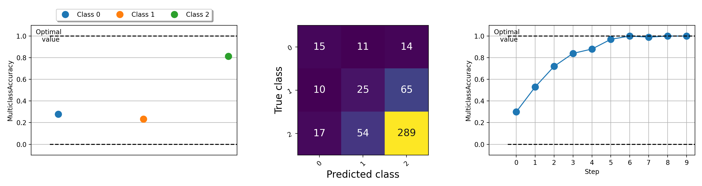

<div align="center">


**Machine learning metrics for distributed, scalable PyTorch applications.**

______________________________________________________________________

<p align="center">
  <a href="#what-is-torchmetrics">What is Torchmetrics</a> •
  <a href="#implementing-your-own-module-metric">Implementing a metric</a> •
  <a href="#build-in-metrics">Built-in metrics</a> •
  <a href="https://lightning.ai/docs/torchmetrics/stable/">Docs</a> •
  <a href="#community">Community</a> •
  <a href="#license">License</a>
</p>

______________________________________________________________________

[](https://pypi.org/project/torchmetrics/)
[](https://badge.fury.io/py/torchmetrics)
[
](https://pepy.tech/project/torchmetrics)
[](https://anaconda.org/conda-forge/torchmetrics)
[](https://github.com/Lightning-AI/torchmetrics/blob/master/LICENSE)

[](https://github.com/Lightning-AI/torchmetrics/actions/workflows/ci-tests.yml)
[](https://dev.azure.com/Lightning-AI/Metrics/_build/latest?definitionId=54&branchName=master)
[](https://codecov.io/gh/Lightning-AI/torchmetrics)
[](https://results.pre-commit.ci/latest/github/Lightning-AI/torchmetrics/master)

[](https://torchmetrics.readthedocs.io/en/latest/?badge=latest)
[](https://discord.gg/VptPCZkGNa)
[](https://doi.org/10.5281/zenodo.5844769)
[](https://joss.theoj.org/papers/561d9bb59b400158bc8204e2639dca43)

______________________________________________________________________

</div>

## Installation

Simple installation from PyPI

```bash
pip install torchmetrics
```

<details>
  <summary>Other installations</summary>

Install using conda

```bash
conda install -c conda-forge torchmetrics
```

Pip from source

```bash
# with git
pip install git+https://github.com/Lightning-AI/torchmetrics.git@release/stable
```

Pip from archive

```bash
pip install https://github.com/Lightning-AI/torchmetrics/archive/refs/heads/release/stable.zip
```

Extra dependencies for specialized metrics:

```bash
pip install torchmetrics[audio]
pip install torchmetrics[image]
pip install torchmetrics[text]
pip install torchmetrics[all]  # install all of the above
```

Install latest developer version

```bash
pip install https://github.com/Lightning-AI/torchmetrics/archive/master.zip
```

</details>

______________________________________________________________________

## What is TorchMetrics

TorchMetrics is a collection of 100+ PyTorch metrics implementations and an easy-to-use API to create custom metrics. It offers:

- A standardized interface to increase reproducibility
- Reduces boilerplate
- Automatic accumulation over batches
- Metrics optimized for distributed-training
- Automatic synchronization between multiple devices

You can use TorchMetrics with any PyTorch model or with [PyTorch Lightning](https://pytorch-lightning.readthedocs.io/en/stable/) to enjoy additional features such as:

- Module metrics are automatically placed on the correct device.
- Native support for logging metrics in Lightning to reduce even more boilerplate.

## Using TorchMetrics

### Module metrics

The [module-based metrics](https://lightning.ai/docs/torchmetrics/stable/references/metric.html) contain internal metric states (similar to the parameters of the PyTorch module) that automate accumulation and synchronization across devices!

- Automatic accumulation over multiple batches
- Automatic synchronization between multiple devices
- Metric arithmetic

**This can be run on CPU, single GPU or multi-GPUs!**

For the single GPU/CPU case:

```python
import torch

# import our library
import torchmetrics

# initialize metric
metric = torchmetrics.classification.Accuracy(task="multiclass", num_classes=5)

# move the metric to device you want computations to take place
device = "cuda" if torch.cuda.is_available() else "cpu"
metric.to(device)

n_batches = 10
for i in range(n_batches):
    # simulate a classification problem
    preds = torch.randn(10, 5).softmax(dim=-1).to(device)
    target = torch.randint(5, (10,)).to(device)

    # metric on current batch
    acc = metric(preds, target)
    print(f"Accuracy on batch {i}: {acc}")

# metric on all batches using custom accumulation
acc = metric.compute()
print(f"Accuracy on all data: {acc}")
```

Module metric usage remains the same when using multiple GPUs or multiple nodes.

<details>
  <summary>Example using DDP</summary>

<!--phmdoctest-mark.skip-->

```python
import os
import torch
import torch.distributed as dist
import torch.multiprocessing as mp
from torch import nn
from torch.nn.parallel import DistributedDataParallel as DDP
import torchmetrics


def metric_ddp(rank, world_size):
    os.environ["MASTER_ADDR"] = "localhost"
    os.environ["MASTER_PORT"] = "12355"

    # create default process group
    dist.init_process_group("gloo", rank=rank, world_size=world_size)

    # initialize model
    metric = torchmetrics.classification.Accuracy(task="multiclass", num_classes=5)

    # define a model and append your metric to it
    # this allows metric states to be placed on correct accelerators when
    # .to(device) is called on the model
    model = nn.Linear(10, 10)
    model.metric = metric
    model = model.to(rank)

    # initialize DDP
    model = DDP(model, device_ids=[rank])

    n_epochs = 5
    # this shows iteration over multiple training epochs
    for n in range(n_epochs):
        # this will be replaced by a DataLoader with a DistributedSampler
        n_batches = 10
        for i in range(n_batches):
            # simulate a classification problem
            preds = torch.randn(10, 5).softmax(dim=-1)
            target = torch.randint(5, (10,))

            # metric on current batch
            acc = metric(preds, target)
            if rank == 0:  # print only for rank 0
                print(f"Accuracy on batch {i}: {acc}")

        # metric on all batches and all accelerators using custom accumulation
        # accuracy is same across both accelerators
        acc = metric.compute()
        print(f"Accuracy on all data: {acc}, accelerator rank: {rank}")

        # Resetting internal state such that metric ready for new data
        metric.reset()

    # cleanup
    dist.destroy_process_group()


if __name__ == "__main__":
    world_size = 2  # number of gpus to parallelize over
    mp.spawn(metric_ddp, args=(world_size,), nprocs=world_size, join=True)
```

</details>

### Implementing your own Module metric

Implementing your own metric is as easy as subclassing an [`torch.nn.Module`](https://pytorch.org/docs/stable/generated/torch.nn.Module.html). Simply, subclass `torchmetrics.Metric`
and just implement the `update` and `compute` methods:

```python
import torch
from torchmetrics import Metric


class MyAccuracy(Metric):
    def __init__(self):
        # remember to call super
        super().__init__()
        # call `self.add_state`for every internal state that is needed for the metrics computations
        # dist_reduce_fx indicates the function that should be used to reduce
        # state from multiple processes
        self.add_state("correct", default=torch.tensor(0), dist_reduce_fx="sum")
        self.add_state("total", default=torch.tensor(0), dist_reduce_fx="sum")

    def update(self, preds: torch.Tensor, target: torch.Tensor) -> None:
        # extract predicted class index for computing accuracy
        preds = preds.argmax(dim=-1)
        assert preds.shape == target.shape
        # update metric states
        self.correct += torch.sum(preds == target)
        self.total += target.numel()

    def compute(self) -> torch.Tensor:
        # compute final result
        return self.correct.float() / self.total


my_metric = MyAccuracy()
preds = torch.randn(10, 5).softmax(dim=-1)
target = torch.randint(5, (10,))

print(my_metric(preds, target))
```

### Functional metrics

Similar to [`torch.nn`](https://pytorch.org/docs/stable/nn.html), most metrics have both a [module-based](https://lightning.ai/docs/torchmetrics/stable/references/metric.html) and functional version.
The functional versions are simple python functions that as input take [torch.tensors](https://pytorch.org/docs/stable/tensors.html) and return the corresponding metric as a [torch.tensor](https://pytorch.org/docs/stable/tensors.html).

```python
import torch

# import our library
import torchmetrics

# simulate a classification problem
preds = torch.randn(10, 5).softmax(dim=-1)
target = torch.randint(5, (10,))

acc = torchmetrics.functional.classification.multiclass_accuracy(
    preds, target, num_classes=5
)
```

### Covered domains and example metrics

In total TorchMetrics contains [100+ metrics](https://lightning.ai/docs/torchmetrics/stable/all-metrics.html), which
covers the following domains:

- Audio
- Classification
- Detection
- Information Retrieval
- Image
- Multimodal (Image-Text)
- Nominal
- Regression
- Text

Each domain may require some additional dependencies which can be installed with `pip install torchmetrics[audio]`,
`pip install torchmetrics['image']` etc.

### Additional features

#### Plotting

Visualization of metrics can be important to help understand what is going on with your machine learning algorithms.
Torchmetrics have built-in plotting support (install dependencies with `pip install torchmetrics[visual]`) for nearly
all modular metrics through the `.plot` method. Simply call the method to get a simple visualization of any metric!

```python
import torch
from torchmetrics.classification import MulticlassAccuracy, MulticlassConfusionMatrix

num_classes = 3

# this will generate two distributions that comes more similar as iterations increase
w = torch.randn(num_classes)
target = lambda it: torch.multinomial((it * w).softmax(dim=-1), 100, replacement=True)
preds = lambda it: torch.multinomial((it * w).softmax(dim=-1), 100, replacement=True)

acc = MulticlassAccuracy(num_classes=num_classes, average="micro")
acc_per_class = MulticlassAccuracy(num_classes=num_classes, average=None)
confmat = MulticlassConfusionMatrix(num_classes=num_classes)

# plot single value
for i in range(5):
    acc_per_class.update(preds(i), target(i))
    confmat.update(preds(i), target(i))
fig1, ax1 = acc_per_class.plot()
fig2, ax2 = confmat.plot()

# plot multiple values
values = []
for i in range(10):
    values.append(acc(preds(i), target(i)))
fig3, ax3 = acc.plot(values)
```

<p align="center">
  
</p>

For examples of plotting different metrics try running [this example file](examples/plotting.py).

## Contribute!

The lightning + TorchMetrics team is hard at work adding even more metrics.
But we're looking for incredible contributors like you to submit new metrics
and improve existing ones!

Join our [Discord](https://discord.com/invite/tfXFetEZxv) to get help with becoming a contributor!

## Community

For help or questions, join our huge community on [Discord](https://discord.com/invite/tfXFetEZxv)!

## Citation

We’re excited to continue the strong legacy of open source software and have been inspired
over the years by Caffe, Theano, Keras, PyTorch, torchbearer, ignite, sklearn and fast.ai.

If you want to cite this framework feel free to use GitHub's built-in citation option to generate a bibtex or APA-Style citation based on [this file](https://github.com/Lightning-AI/torchmetrics/blob/master/CITATION.cff) (but only if you loved it 😊).

## License

Please observe the Apache 2.0 license that is listed in this repository.
In addition, the Lightning framework is Patent Pending.
