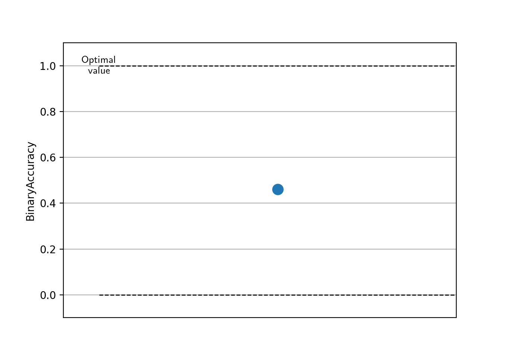
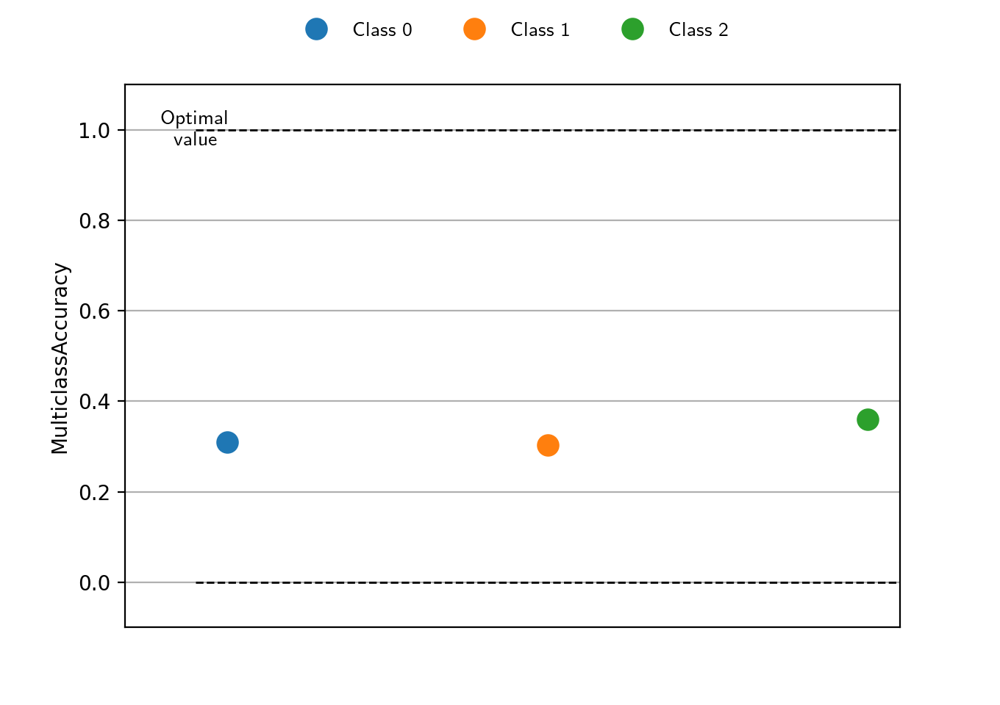
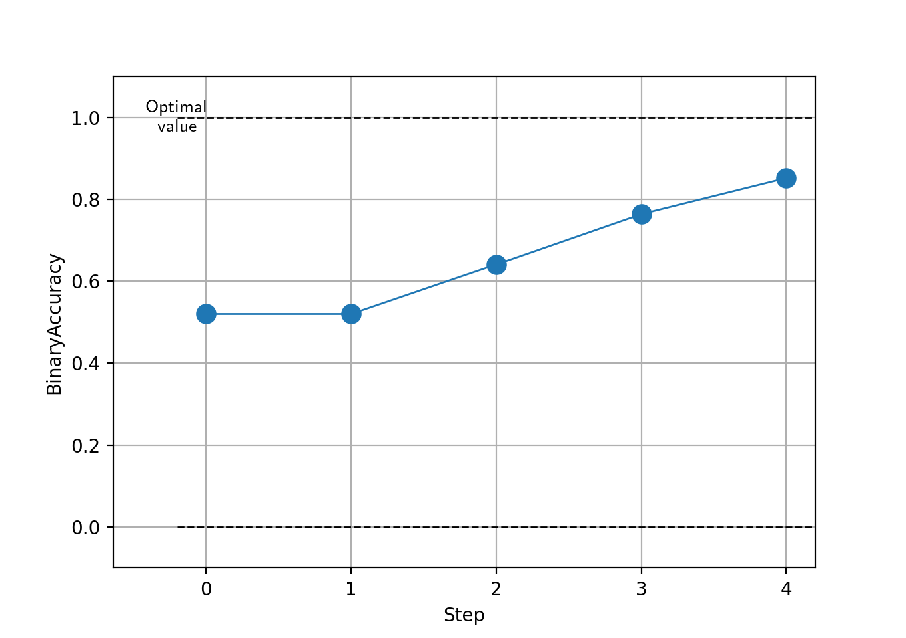
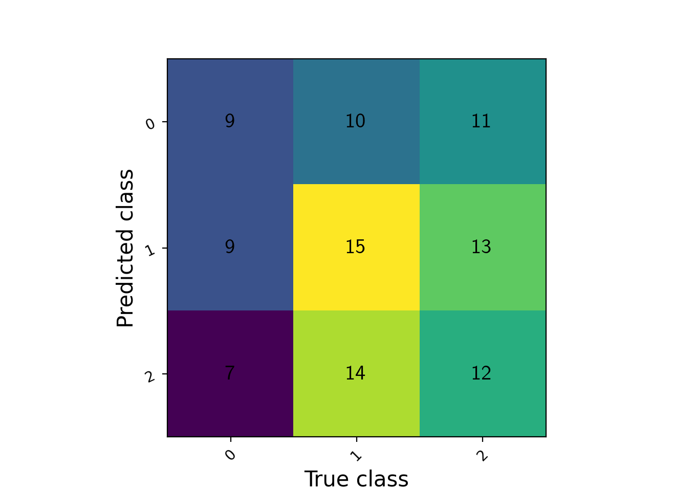

# Torchmetrics v1.0 - 100+ metrics and plotting

We are happy to announce that the first major release of Torchmetrics, version v1.0, is not publicly available. We have
worked hard on a couple of new features for this milestone release, but we for v1.0.0 we have also managed to implement
over **100** metrics in torchmetrics.

In this blogpost we go over some of the new features and improvements to the library.

## Plotting
The big new feature of v1.0 is a build-in plotting feature. As the old saying goes:
*"A picture is worth a thousand words"*. Within machine learning, this is definitely also true for many things.
Metrics are one area that in some cases are definitely better showcased in a figure than as list of floats. The only
requirement for getting started with the plotting feature is installing `matplotlib`. Either install with
`pip install matplotlib` or `pip install torchmetrics[visual]` (the latter option also installs
[Scienceplots](https://github.com/garrettj403/SciencePlots) and uses that as default plotting style).

The basic interface is the same for **any** metric. Just call the new  `.plot` method:

```python
metric = AnyMetricYouLike()
for _ in range(num_updates):
    metric.update(preds[i], target[i])
fig, ax = metric.plot()
```

The `plot` method by default does not require any arguments and will automatically call `metric.compute` internally on
whatever metric states have been accumulated.

At the most basic level, the plot method can be used to used to plot the value from a single step:

```python
metric = torchmetrics.Accuracy(task="binary")
for _ in range(num_updates):
    metric.update(torch.rand(10,), torch.randint(2, (10,)))
fig, ax = metric.plot()
```
which would generate a plot like



A single point plot is not that informative in itself, but if available we will try to include additional information
such as the lower and upper bounds the particular metric can take and if the metric should be minimized or maximized to
be optimal. For experience users this may not have that big of an value, but for newcomers to machine learning or just
somebody wanting to learn about a new metric, this can be beneficial.

If a metric returns multiple values these can also be plotted, such that each value will be plotted individually and
labeled:

```python
metric = torchmetrics.Accuracy(task="multiclass", num_classes=3, average=None)
for _ in range(num_updates):
    metric.update(torch.randint(3, (10,)), torch.randint(3, (10,)))
fig, ax = metric.plot()
```


Finally, common practice is to plot a sequence of metric outputs like the progress over a training run. The `.plot`
method support the user providing such a sequence of outputs, which will then be plotted as a line:ne:

```python
metric = torchmetrics.Accuracy(task="binary")
values = [ ]
for step in range(num_steps):
    for _ in range(num_updates):
        metric.update(preds(step), target(step))
    values.append(metric.compute())  # save value
    metric.reset()
fig, ax = metric.plot(values)
```



Where the plotting feature really shines are metrics that are not represented by a single or a few numerical values.
Two good examples are the classical `ConfusionMatrix` and `ROC` metrics. For metrics like these, we have written custom
plot routines to generate the appropriate plots, with the interface still only being the `.plot` method:

```python
metric = torchmetrics.ConfusionMatrix(task="multiclass", num_classes=3)
for _ in range(N):
    metric.update(torch.randint(3, (10,)), torch.randint(3, (10,)))
metric.plot(ax=ax)
```



```python
metric = torchmetrics.ROC(task="binary")
for _ in range(N):
    metric.update(torch.rand(10), torch.randint(2, (10,)))
metric.plot(ax=ax)
```


This feature is not meant (for now) to create publishing ready figures out of the box. Instead it is meant as an
quick-and-dirty way to visualize any metric in Torchmetrics. If you have suggestion for how to improve the quality of
the plots or make them more informative in some way, feel free to reach out to us.

For a more explanation on this feature, visit our documentation:
https://torchmetrics.readthedocs.io/en/latest/pages/plotting.html

## New metrics
As already stated, for Torchmetrics v1.0 we have also crossed the milestone of having over 100 unique metrics. These
metrics are divided between 12 different sub categories of metrics. Since the last release these 15 new metrics have
been added to Torchmetrics:

* `ComplexScaleInvariantSignalNoiseRatio` have been added to `audio` subpackage
* `Running`  and `MultitaskWrapper` have been added to the metric `wrapper` subpackage. Here we want to highlight
    the `Running` wrapper that allows our users to calculate running averages over any metric the like.

    ```python
    # Running sum metric
    from torchmetrics.wrappers import Running
    from torchmetrics.aggregation import SumMetric
    # Only calculate over last two samples
    metric = Running(SumMetric(), window=2)
    for x in [1, 2, 3, 4]:
        metric.update(x)
    res = metric.compute()  # res=7=3+4
    ```

* `SpecificityAtSensitivity`, `BinaryGroupFairness` and `PrecisionAtFixedRecall` have been added to the `classification`
    subpackage. Here we want to highlight the `BinaryGroupFairness` metric that is useful for determining the fairness
    of your machine learning algorithms and if they seem to have any kind of bias.

* `MinkowskiDistance` and `RelativeSquaredError` have been added to `regression` subpackage

* `PSNRB` have been added to the `image` subpackage.

* `IntersectionOverUnion`, `GeneralizedIntersectionOverUnion`, `CompleteIntersectionOverUnion`,
    `DistanceIntersectionOverUnion`, `PanopticQuality` and `ModifiedPanopticQuality` have been added to the `detection`
    subpackage.

## Other important changes

In addition to the new plotting feature and newly added metrics, the following changes in v1.0 is also worth noticing:

* We added official support for python 3.11 and have removed support for python 3.7

* We have deprecated importing most metrics from the root of `torchmetrics`. Therefore, from the next release, import
    statements of the type `from torchmetrics import ...` is no longer possible for any metric from the subpackages:
    Audio, Detection, Image, Retrieval, Text. Instead these should be imported from their subpackages:
    `from torchmetrics.subdomain import ...`. An example:

    ```python
    # versions below v1.0
    from torchmetrics import PSNR
    # version above v1.0
    from torchmetrics.image import PSNR
    ```

    we have kept metrics from the classification and regression packages as these can be considered meta domains e.g.
    if working on image data you may need to use a combination of classification and image metrics to evaluate your
    machine learning models.

* The `MeanAveragePrecision` metric for the detection subpackage, now requires pycocotools to be installed. We have for
    the longest time tried to have a pure-torch implementation as the back engine, however that has been hard to
    maintain, wrong in corner cases and much slower than the official implementation. We now use pycocotools as the
    back engine for doing the calculation, while still providing the exact same interface as user have been used to.

For a list of all new features, changes, deprecations and bug fixes we refer to the changelog:
https://github.com/Lightning-AI/torchmetrics/blob/master/CHANGELOG.md

## Future goals
v1.0 officially marks the first stable release of Torchmetrics. However, the truth is that the API has not really
changed since v0.1 and we have considered it stable for at least a couple of releases.

For the future we plan on expanding to even more metrics, making sure that if you ever need a metric for measuring the
performance of your machine learning models, you can find it in Torchmetrics.

## Thank you!

Big thanks to all our community members for their contributions and feedback. If you have any recommendations for the
next metric that we should try to tackle, please open an issue in the [repo](https://github.com/Lightning-AI/metrics).

We are happy to see a continued adaption of TorchMetrics in over 12000+ projects, and this release also marks the point
where we crossed 1500+ GitHub stars.

Finally, If you would like to give open source a try, we have the `#new_contributors` and `#metrics` channel on the
general PyTorch-lightning
[slack](https://join.slack.com/t/pytorch-lightning/shared_invite/zt-f6bl2l0l-JYMK3tbAgAmGRrlNr00f1A) where you can ask
a question and get guidance.